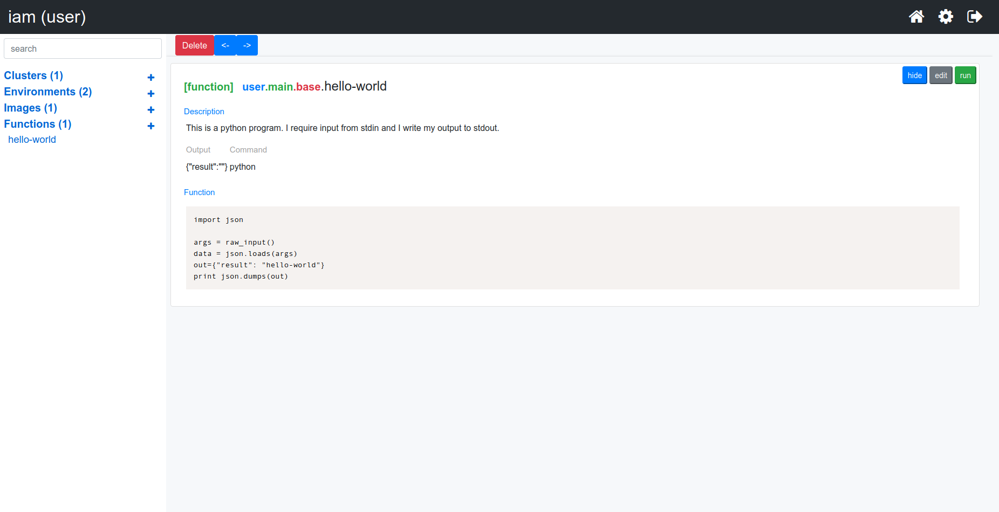
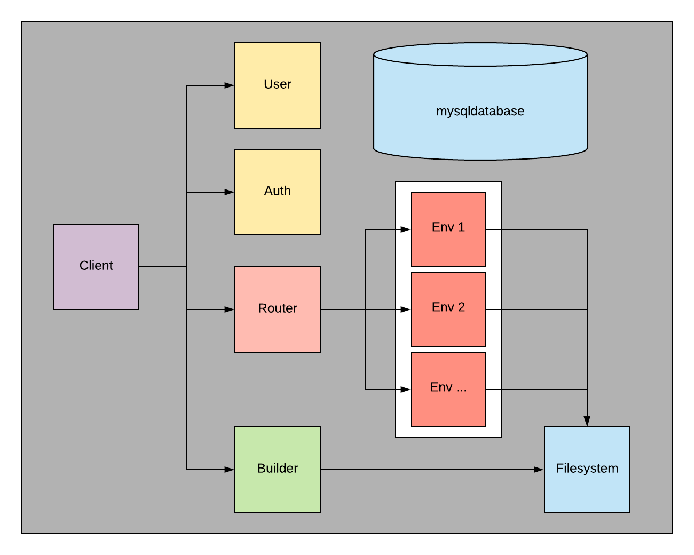

# Iam: Distributed Computing Platform

Iam is a space for collaborating and building. Use it to: 
- Create custom environments.
- Create highly available functions. 
- Combine functions into distributed pipelines. 

A single interface provides all the tools to write and experiment with code on a highly scalable, highly available cluster. Machine Learning engineers need a way to minimize complexity in getting experimentation code into a production size computing environment. 

This platform enables the same freedom and iteration speed as developing locally with tools like [Jupyter Notebook](https://jupyter.org/). Transitioning code from a notebook to a highly scalable platform requires no additional effort from the developer, other than copying it from one editor to another.

## Beta Testing Environment
Request access to the beta testing environment for testing out the platform and giving collaborative feedback! [Email Me](mailto:icanplayguitar94@gmail.com?Subject=IAM%20Beta%20Access)

## The Platform
The Iam platform is deployed to [Kubernetes](https://kubernetes.io/). Create different environments that contain unique sets of dependencies and scale them as required. Each environment can use a completely custom image or use the executor image to expose pods for running executables. Write scripting code to run on these executors seemlessly through the UI, and combine them into graphs for optimal execution management of complex processes.

#### Tutorials
Follow the [introduction](https://github.com/tallen94/iam/blob/master/tutorials/introduction.md) tutorial to learn about the main concepts of Iam.

### System Diagram

