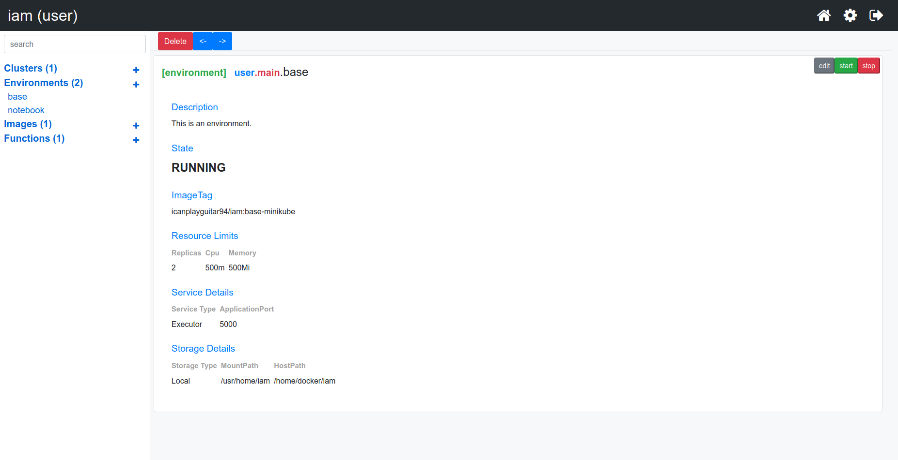

# Introduction
This tutorial will introduce you to the main concepts of IAM.

### Users
Each person that uses IAM creates their own personal account. These accounts are meant to be private repositories for development. 
Users can give other users permission to use the resources in their account.

#### Clusters
Clusters are organizations of Environments and Executables. This is an abstraction meant to provide a space for several users to contribute to resources owned by a single account.


#### Environments
These are load balanced services for running executables. Environments allow configurable parameters to control:
- Docker image reference
- Service ports
- Number of instances
- CPU and Memory allocation per instance
- Volume Storage

Environments that extend the base image `icanplayguitar/iam:base-*`, and are of type `executor`, can be used to run any other `executable`.

Each `executable` must specify what environment it is run in. 



### Executables
Executables are the runnable resources available on the cluster. You can:
- Add and executable
- Get and executable
- Get a list of executables for a user
- Run and executable

These operations are available as the `Executable Api`

#### Function
Functions are pieces of code. Functions require a command and code to run that takes input from stdin and outputs to stdout.
Once you write a function, it is immediately accessible via the `Executable Api`. 

When running a `function`, the POST request body is passed into the `stdin` pipe. All of the output into the `stdout` pipe will be returned in the response body of the api request. 

If specifying an additional set of arguments in the `args` field, use `{key}` as a way to inject values from requests with a json body.


#### Secrets
Secrets are sensitive information. In order to reference a secret, use the `$secret` value to have the system automatically hydrate it.

```
curl -X POST -d '{ "test": "$secret" }' <iam_url>/executable/:username/:cluster/:environment/:exe/:name/run
```


#### Graphs 
Graphs are descriptions of the execution plan of a series of `functions`. Steps can be linked in sequential and parallel patterns.

Graphs are Directed Acyclic Graphs. They can have as many starting and ending nodes, with any edges as long as no cycles are created.


Nodes on a graph are indexed in topological sort order, with parallel nodes indexed by when they were added to the graph.

There are a few different ways of specifying input into a graph. 
- Graphs with a single start node will be passed the whole request body.
- Graphs with multiple start nodes will expect an `[]` of data where the ith object is passed to the corresponding ith start node.
- Using the `FOREACH` option will make a node expect an `[]` of data input and execute the node for each item in that dataset.

#### Jobs
Jobs are schedules to automatically trigger executables. You provide the schedule, executable, and any input data. Currently, output data
is not saved anywhere.


